# Aura — AI-Powered Code Editor

Aura is a full-featured, AI-powered code editor with in-browser project runtime. Users can create projects, edit code through AI conversation, and preview running applications directly in the browser — no local setup or terminal required.

Built with Next.js 16, React 19, Convex, Clerk, and WebContainer API.

**[Try Aura Live](https://aura.azuritek.com)**

---

## Screenshots

### Landing Page
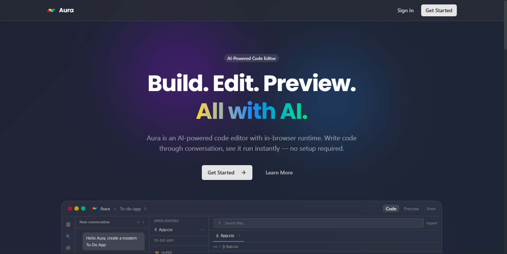

### Sign In
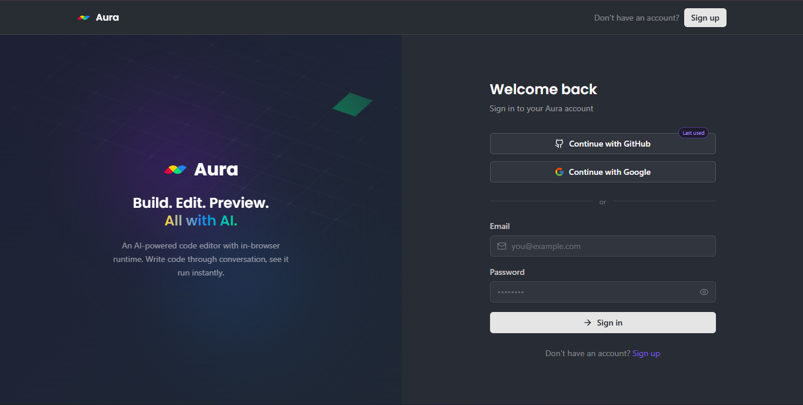

### Projects Dashboard
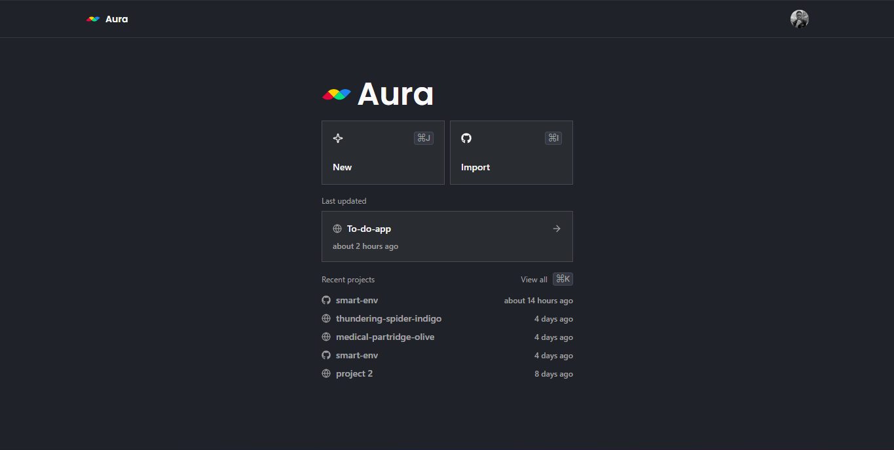

### New Project — AI Prompt
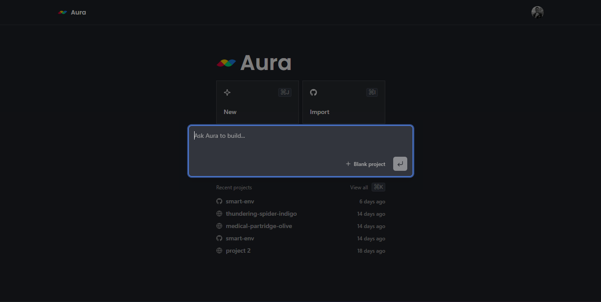

### Import from GitHub
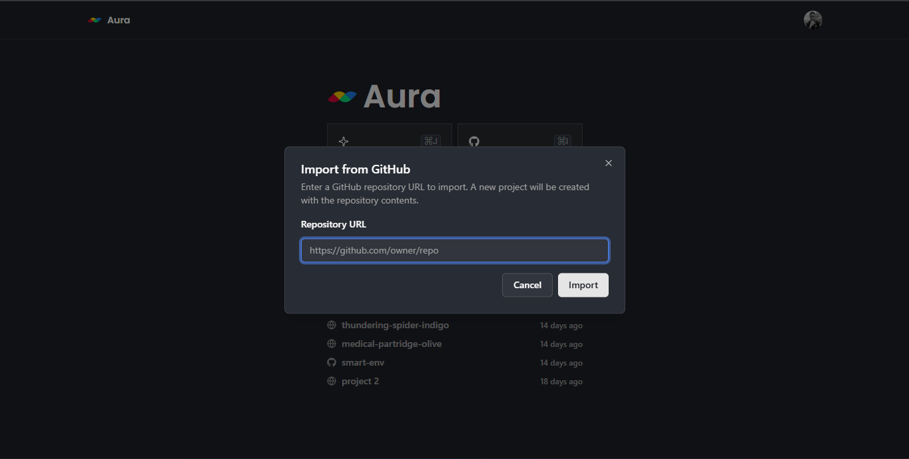

### Code Editor — File Explorer & AI Chat
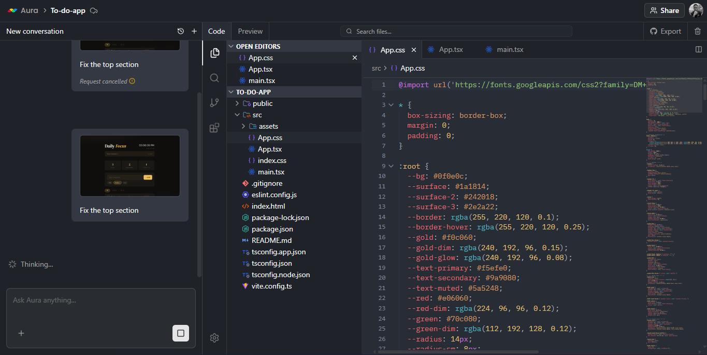

### Live Preview — In-Browser Runtime
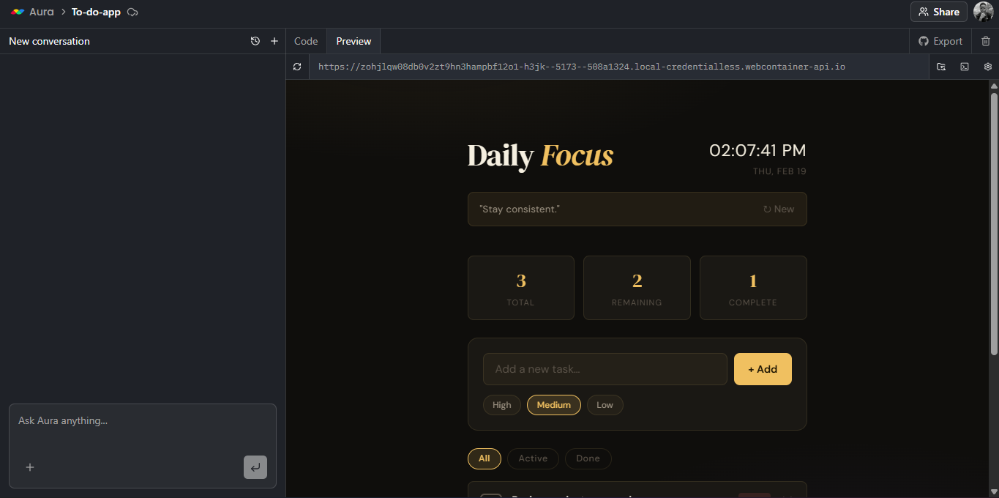

### Preview with Terminal
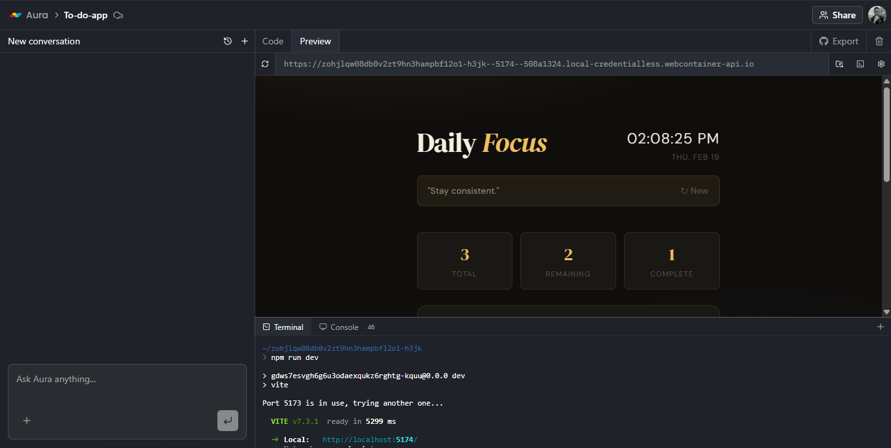

### Export to GitHub
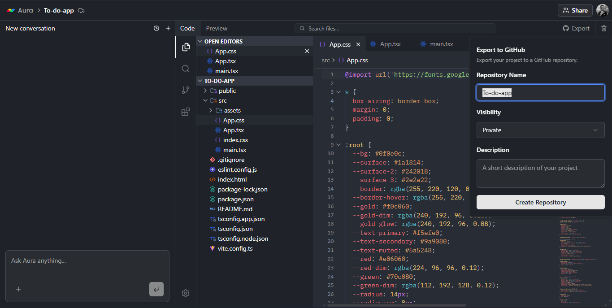

### Editor Extensions Marketplace
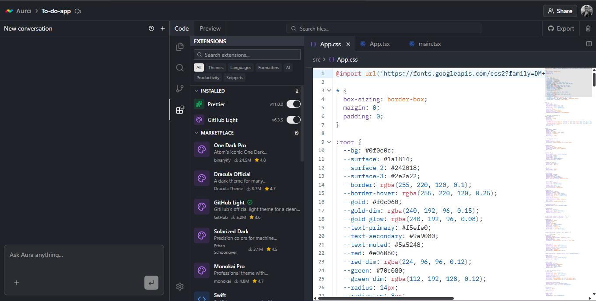

### File Search / Quick Open


### Share Project
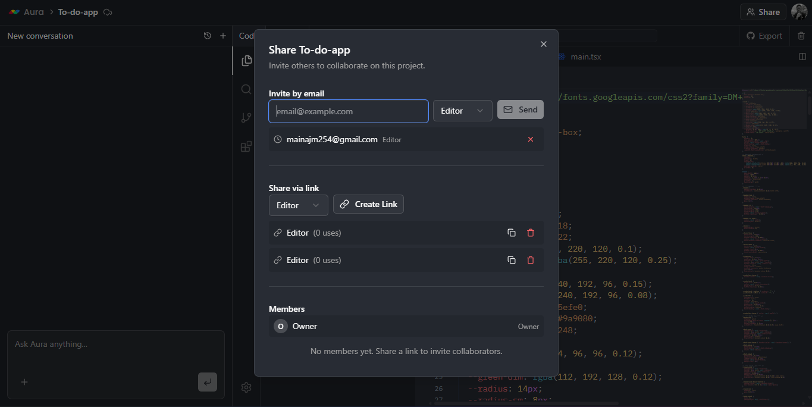

---

## Table of Contents

- [Screenshots](#screenshots)
- [Features](#features)
- [Tech Stack](#tech-stack)
- [Architecture](#architecture)
- [Directory Structure](#directory-structure)
- [Database Schema](#database-schema)
- [AI Models](#ai-models)
- [AI Agent System](#ai-agent-system)
- [Editor Extensions](#editor-extensions)
- [WebContainer Runtime](#webcontainer-runtime)
- [GitHub Integration](#github-integration)
- [API Routes](#api-routes)
- [Authentication](#authentication)
- [Getting Started](#getting-started)
- [Environment Variables](#environment-variables)
- [Scripts](#scripts)
- [Deployment](#deployment)
- [Monitoring](#monitoring)
- [License](#license)

---

## Features

### AI Code Assistant
- Chat-based coding with Claude Opus 4 as the primary agent
- The AI can list, read, create, update, delete, and rename files autonomously
- Automatic conversation title generation with Claude 3.5 Haiku
- Web scraping capabilities via Firecrawl for referencing external documentation

### Code Editor
- Full CodeMirror 6 editor with syntax highlighting for 15+ languages (JavaScript, TypeScript, Python, Rust, Go, Java, C++, PHP, SQL, HTML, CSS, JSON, YAML, XML, Markdown)
- One Dark theme
- Minimap, indentation markers, search, autocomplete, and linting
- Three AI-powered inline extensions:
  - **Explain** — Select code and get an AI explanation
  - **Suggestion** — Receive inline code suggestions
  - **Quick Edit** — Describe a change and let AI modify the code

### In-Browser Preview
- Powered by WebContainer API — runs Node.js projects entirely in the browser
- Integrated xterm.js terminal with interactive shell
- Auto-installs dependencies and starts the dev server
- Bidirectional file sync between the editor and WebContainer
- Configurable install and dev commands per project

### GitHub Integration
- Import existing GitHub repositories (files, folders, and binary assets)
- Export projects back to GitHub as new repositories
- OAuth-based authentication through Clerk
- Full tree/blob/commit creation via the GitHub API

### Project Management
- Create new projects or import from GitHub
- Rename projects inline
- Keyboard shortcuts: `Cmd+J` (new project), `Cmd+I` (import), `Cmd+K` (command palette)
- Auto-generated project names using unique-names-generator
- Real-time project list with last-updated timestamps

### Real-Time Data
- All data operations go through Convex with real-time subscriptions
- Messages stream in real-time as the AI agent processes them
- File changes sync instantly across the editor and preview

---

## Tech Stack

| Layer | Technology |
|---|---|
| **Framework** | Next.js 16.1.1 (App Router, Turbopack) |
| **UI** | React 19, TypeScript, Tailwind CSS 4 |
| **Components** | shadcn/ui (50+ components), Radix UI primitives |
| **Database** | Convex (serverless, real-time subscriptions) |
| **Auth** | Clerk (JWT-based, OAuth for GitHub) |
| **AI SDK** | Vercel AI SDK with Anthropic, Google, Groq, OpenAI, DeepSeek providers |
| **Agent** | Inngest with Agent Kit for reliable multi-step AI orchestration |
| **Editor** | CodeMirror 6 with extensions |
| **Runtime** | WebContainer API (in-browser Node.js) |
| **Terminal** | xterm.js |
| **State** | Zustand (client), Convex hooks (server) |
| **Monitoring** | Sentry (traces, logs, Vercel AI integration) |
| **Scraping** | Firecrawl |
| **GitHub API** | Octokit |
| **Forms** | React Hook Form, TanStack Form, Zod validation |
| **Animations** | Motion (Framer Motion), Rive, CSS keyframes |
| **Fonts** | Inter (sans), IBM Plex Mono (mono), Poppins (branding) |

---

## Architecture

### High-Level Flow

```
User (Browser)
  │
  ├─ Next.js App Router (pages & API routes)
  │    ├─ Clerk auth (JWT verification)
  │    ├─ Convex client (real-time queries & mutations)
  │    └─ API routes → Inngest events
  │
  ├─ Convex Backend
  │    ├─ Schema: projects, files, conversations, messages
  │    ├─ Queries: real-time subscriptions
  │    └─ Mutations: authenticated via verifyAuth()
  │
  ├─ Inngest (Background Jobs)
  │    ├─ processMessage → Claude Opus 4 agent with 8 tools
  │    ├─ importGithubRepo → Octokit tree fetch + file creation
  │    └─ exportToGithub → blob/tree/commit creation
  │
  └─ WebContainer (In-Browser)
       ├─ Mounts file tree from Convex
       ├─ Spawns interactive shell (jsh)
       ├─ Runs npm install + dev server
       └─ Syncs file changes bidirectionally
```

### Key Patterns

- **Feature-Based Architecture** — Each feature in `src/features/` is self-contained with its own components, hooks, stores, and inngest functions. Cross-feature dependencies are minimal.
- **Convex Data Layer** — All data operations go through Convex. Queries provide real-time updates. Mutations are authenticated via the `verifyAuth()` helper.
- **AI Agent with Inngest** — The AI coding agent uses Inngest's step API for reliable, resumable execution. The agent runs in a loop (max 20 iterations) with access to 8 file-operation tools.
- **Editor Extensions** — CodeMirror extensions follow a consistent pattern with `index.ts` for logic and `fetcher.ts` for API calls.
- **State Management** — Zustand for local client state (editor tabs, UI state), Convex hooks for server state (projects, files, messages).

---

## Directory Structure

```
aura/
├── convex/                    # Convex backend
│   ├── schema.ts              # Database schema (projects, files, conversations, messages)
│   ├── auth.ts                # verifyAuth() helper
│   ├── auth.config.ts         # Clerk JWT configuration
│   ├── projects.ts            # Project queries & mutations
│   ├── files.ts               # File queries & mutations
│   ├── conversations.ts       # Conversation queries & mutations
│   ├── messages.ts            # Message queries & mutations
│   └── _generated/            # Auto-generated Convex types
│
├── src/
│   ├── app/                   # Next.js App Router
│   │   ├── layout.tsx         # Root layout (fonts, providers)
│   │   ├── page.tsx           # Home page (ProjectsView)
│   │   ├── globals.css        # Global styles, CSS animations
│   │   ├── global-error.tsx   # Sentry error boundary
│   │   ├── projects/
│   │   │   └── [projectId]/
│   │   │       ├── page.tsx   # Project editor page
│   │   │       └── layout.tsx # Project layout
│   │   └── api/
│   │       ├── messages/
│   │       │   ├── route.ts       # POST: send message, trigger agent
│   │       │   └── cancel/
│   │       │       └── route.ts   # POST: cancel processing message
│   │       ├── explain/
│   │       │   └── route.ts       # POST: code explanation
│   │       ├── suggestion/
│   │       │   └── route.ts       # POST: inline code suggestions
│   │       ├── quick-edit/
│   │       │   └── route.ts       # POST: AI code modifications
│   │       ├── projects/
│   │       │   └── create-with-prompt/
│   │       │       └── route.ts   # POST: create project with AI
│   │       ├── github/
│   │       │   ├── import/
│   │       │   │   └── route.ts   # POST: import GitHub repo
│   │       │   └── export/
│   │       │       ├── route.ts   # POST: export to GitHub
│   │       │       ├── cancel/
│   │       │       │   └── route.ts   # POST: cancel export
│   │       │       └── reset/
│   │       │           └── route.ts   # POST: reset export status
│   │       └── inngest/
│   │           └── route.ts       # Inngest webhook (GET/POST/PUT)
│   │
│   ├── components/
│   │   ├── providers.tsx      # ClerkProvider + ConvexProvider + ThemeProvider
│   │   ├── theme-provider.tsx # next-themes dark mode
│   │   ├── ui/               # 50+ shadcn/ui components
│   │   └── ai-elements/      # AI-specific UI (messages, code blocks, model selector)
│   │
│   ├── features/
│   │   ├── auth/              # Authentication
│   │   │   └── components/
│   │   │       ├── unauthenticated-view.tsx   # Landing page
│   │   │       └── auth-loading-view.tsx      # Loading spinner
│   │   │
│   │   ├── projects/          # Project management
│   │   │   ├── components/
│   │   │   │   ├── projects-view.tsx          # Dashboard with navbar
│   │   │   │   ├── projects-list.tsx          # Project list
│   │   │   │   ├── projects-command-dialog.tsx # Command palette (Cmd+K)
│   │   │   │   ├── new-project-dialog.tsx     # New project dialog
│   │   │   │   ├── import-github-dialog.tsx   # GitHub import dialog
│   │   │   │   ├── navbar.tsx                 # Editor navbar
│   │   │   │   ├── project-id-view.tsx        # Project editor layout
│   │   │   │   └── file-explorer/             # File tree sidebar
│   │   │   ├── hooks/
│   │   │   │   └── use-projects.ts            # Project CRUD hooks
│   │   │   └── inngest/
│   │   │       ├── import-github-repo.ts      # GitHub import function
│   │   │       └── export-to-github.ts        # GitHub export function
│   │   │
│   │   ├── editor/            # Code editor
│   │   │   ├── components/
│   │   │   │   ├── editor-view.tsx            # Main editor component
│   │   │   │   └── editor-tabs.tsx            # File tabs
│   │   │   ├── extensions/
│   │   │   │   ├── custom-setup.ts            # CodeMirror setup
│   │   │   │   ├── theme.ts                   # One Dark theme
│   │   │   │   ├── language-extension.ts      # Language support
│   │   │   │   ├── minimap.ts                 # Minimap
│   │   │   │   ├── selection-tooltip.ts       # Selection tooltip
│   │   │   │   ├── explain/                   # AI explain extension
│   │   │   │   ├── suggestion/                # AI suggestion extension
│   │   │   │   └── quick-edit/                # AI quick-edit extension
│   │   │   └── store/
│   │   │       └── editor-store.ts            # Zustand store (tabs, active file)
│   │   │
│   │   ├── conversations/     # AI chat
│   │   │   ├── components/                    # Chat UI
│   │   │   └── inngest/
│   │   │       ├── process-message.ts         # Main AI agent function
│   │   │       ├── constants.ts               # System prompt, config
│   │   │       └── tools/                     # 8 agent tools
│   │   │           ├── list-files.ts
│   │   │           ├── read-files.ts
│   │   │           ├── create-files.ts
│   │   │           ├── create-folder.ts
│   │   │           ├── update-file.ts
│   │   │           ├── delete-files.ts
│   │   │           ├── rename-file.ts
│   │   │           └── scrape-urls.ts
│   │   │
│   │   └── preview/           # In-browser runtime
│   │       ├── components/
│   │       │   ├── preview-terminal.tsx        # xterm.js terminal
│   │       │   └── preview-settings-popover.tsx # Settings UI
│   │       ├── hooks/
│   │       │   └── use-webcontainer.ts         # WebContainer lifecycle
│   │       └── utils/
│   │           └── file-tree.ts                # File tree builder
│   │
│   ├── inngest/
│   │   ├── client.ts          # Inngest client (id: "aura")
│   │   └── functions.ts       # Demo functions
│   │
│   └── lib/
│       ├── utils.ts           # cn() utility
│       ├── convex-client.ts   # Convex internal client
│       └── firecrawl.ts       # Firecrawl client
│
├── public/
│   ├── logo.svg               # Aura logo (4-color: red, blue, yellow, green)
│   └── logo1.svg              # Alternate logo
│
├── next.config.ts             # Next.js config (COEP/COOP headers, Sentry)
├── sentry.client.config.ts    # Sentry browser config
├── sentry.server.config.ts    # Sentry server config
├── sentry.edge.config.ts      # Sentry edge config
├── components.json            # shadcn/ui config (new-york style)
├── CLAUDE.md                  # Claude Code instructions
├── package.json
├── tsconfig.json
└── tailwind.config.ts
```

---

## Database Schema

Aura uses [Convex](https://convex.dev) as its serverless database with real-time subscriptions.

### projects

| Field | Type | Description |
|---|---|---|
| `name` | `string` | Project name |
| `ownerId` | `string` | Clerk user ID |
| `updatedAt` | `number` | Last update timestamp |
| `importStatus` | `"importing" \| "completed" \| "failed"` | GitHub import status |
| `exportStatus` | `"exporting" \| "completed" \| "failed" \| "cancelled"` | GitHub export status |
| `exportRepoUrl` | `string?` | Exported GitHub repo URL |
| `settings` | `object?` | `{ installCommand?, devCommand? }` |

**Index:** `by_owner` on `[ownerId]`

### files

| Field | Type | Description |
|---|---|---|
| `projectId` | `Id<"projects">` | Parent project |
| `parentId` | `Id<"files">?` | Parent folder (null = root) |
| `name` | `string` | File or folder name |
| `type` | `"file" \| "folder"` | Entry type |
| `content` | `string?` | Text file content |
| `storageId` | `Id<"_storage">?` | Binary file storage reference |
| `updatedAt` | `number` | Last update timestamp |

**Indexes:** `by_project`, `by_parent`, `by_project_parent`

### conversations

| Field | Type | Description |
|---|---|---|
| `projectId` | `Id<"projects">` | Parent project |
| `title` | `string` | Conversation title |
| `updatedAt` | `number` | Last update timestamp |

**Index:** `by_project` on `[projectId]`

### messages

| Field | Type | Description |
|---|---|---|
| `conversationId` | `Id<"conversations">` | Parent conversation |
| `projectId` | `Id<"projects">` | Parent project |
| `role` | `"user" \| "assistant"` | Message author |
| `content` | `string` | Message text |
| `status` | `"processing" \| "completed" \| "cancelled"` | Processing status |

**Indexes:** `by_conversation`, `by_project_status`

---

## AI Models

| Model | Provider | Purpose | Temperature |
|---|---|---|---|
| **claude-opus-4-20250514** | Anthropic | Primary coding agent (chat, file ops, code generation) | 0.3 |
| **claude-3-5-haiku-20241022** | Anthropic | Conversation title generation | 0 |
| **gemini-2.5-flash** | Google | Demo generation with URL scraping | — |
| **llama-3.3-70b-versatile** | Groq | Editor extensions (explain, suggestion, quick-edit) | 0.3 |

Additional providers (OpenAI, DeepSeek) are installed and available for future use.

---

## AI Agent System

The AI coding agent is powered by Inngest Agent Kit and runs as a background function triggered when a user sends a message.

### Workflow

1. User sends a message via `/api/messages`
2. An Inngest event `messages/process` is dispatched
3. The agent runs with Claude Opus 4 in a loop (max 20 iterations)
4. Each iteration: the model decides which tools to call
5. Tool results are fed back to the model
6. The final response is saved as an assistant message
7. A conversation title is auto-generated on the first exchange

### Agent Tools

| Tool | Description |
|---|---|
| `listFiles` | Lists all files and folders in the project |
| `readFiles` | Reads content of multiple files by ID |
| `createFiles` | Batch-creates files in a specified folder |
| `createFolder` | Creates a new folder |
| `updateFile` | Updates an existing file's content |
| `deleteFiles` | Recursively deletes files and folders |
| `renameFile` | Renames a file or folder |
| `scrapeUrls` | Scrapes web content via Firecrawl |

### System Prompt

The agent identifies as **Aura, an expert AI coding assistant**. Its workflow is:
1. **List** existing files to understand the project
2. **Read** relevant files for context
3. **Execute** changes using file tools
4. **Verify** by reading back modified files
5. **Summarize** what was done

---

## Editor Extensions

CodeMirror 6 extensions provide three AI-powered features accessible from the editor:

### Explain
Select code, click "Explain" — the AI returns a natural-language explanation of the selected code. Uses Groq (Llama 3.3 70B) via `/api/explain`.

### Suggestion
Get inline code suggestions based on the current file context. Uses Groq via `/api/suggestion`.

### Quick Edit
Describe a change in natural language (e.g., "add error handling"), and the AI modifies the selected code. Uses Groq via `/api/quick-edit`.

### Additional Extensions
- **One Dark theme** — Consistent dark theme across the editor
- **Minimap** — Bird's-eye view of the file (via @replit/codemirror-minimap)
- **Indentation markers** — Visual indent guides
- **Language support** — 15+ languages: JavaScript, TypeScript, JSX, TSX, Python, Rust, Go, Java, C++, PHP, SQL, HTML, CSS, JSON, YAML, XML, Markdown

---

## WebContainer Runtime

Aura uses [WebContainer API](https://webcontainers.io) to run Node.js projects entirely in the browser.

### How It Works

1. A singleton WebContainer instance boots with COEP `credentialless` headers
2. The file tree from Convex is mounted into the container
3. An interactive shell (`jsh`) is spawned and connected to xterm.js
4. The container auto-runs the install command (`npm install`) followed by the dev command (`npm run dev --turbo=false`)
5. File changes in the editor sync to WebContainer in real-time
6. File changes made inside WebContainer (e.g., by build tools) sync back to Convex

### Ignored Paths
The following directories are excluded from sync: `node_modules`, `.git`, `.next`, `dist`, `build`, `.cache`, `.turbo`, `.svelte-kit`.

### Configuration
Each project can customize:
- **Install command** — defaults to `npm install`
- **Dev command** — defaults to `npm run dev --turbo=false`

### Required Headers
WebContainer requires specific COOP/COEP headers set in `next.config.ts`:
```
Cross-Origin-Embedder-Policy: credentialless
Cross-Origin-Opener-Policy: same-origin
```

---

## GitHub Integration

### Import
1. User clicks "Import" and selects a GitHub repository
2. An Inngest function (`github/import.repo`) is triggered
3. Clerk provides the user's GitHub OAuth token
4. Octokit fetches the full repository tree
5. Folders are created depth-first (parents before children)
6. Files are created with text content or uploaded to Convex storage for binary files
7. Import status updates in real-time

### Export
1. User clicks "Export" from the project editor
2. An Inngest function (`github/export.repo`) is triggered
3. A new GitHub repository is created via the API
4. All project files are converted to Git blobs
5. A tree and initial commit are created
6. The export status and repo URL update in real-time
7. Exports can be cancelled mid-process

---

## API Routes

| Method | Route | Description |
|---|---|---|
| `POST` | `/api/messages` | Send a user message, triggers the AI agent |
| `POST` | `/api/messages/cancel` | Cancel a processing message |
| `POST` | `/api/explain` | Get AI explanation for selected code |
| `POST` | `/api/suggestion` | Get inline code suggestions |
| `POST` | `/api/quick-edit` | AI-powered code modifications |
| `POST` | `/api/projects/create-with-prompt` | Create a project with an AI prompt |
| `POST` | `/api/github/import` | Import a GitHub repository |
| `POST` | `/api/github/export` | Export project to GitHub |
| `POST` | `/api/github/export/cancel` | Cancel an in-progress export |
| `POST` | `/api/github/export/reset` | Reset export status |
| `GET/POST/PUT` | `/api/inngest` | Inngest webhook endpoint |

---

## Authentication

Aura uses [Clerk](https://clerk.com) for authentication with JWT verification.

### Flow
1. Users sign in via Clerk's `<SignInButton>` component
2. Clerk issues JWTs verified by Convex on every query/mutation
3. The `verifyAuth()` helper in `convex/auth.ts` extracts the user identity
4. GitHub OAuth tokens are retrieved from Clerk for repo import/export
5. The `<UserButton>` component provides account management and sign-out

### Theme
Clerk components use the `dark` base theme with custom variables matching Aura's oklch purple-blue palette.

---

## Getting Started

### Prerequisites

- Node.js 18+
- npm
- A [Convex](https://convex.dev) account and project
- A [Clerk](https://clerk.com) application
- An [Anthropic](https://anthropic.com) API key
- An [Inngest](https://inngest.com) account
- (Optional) [Firecrawl](https://firecrawl.dev) API key for web scraping
- (Optional) [Groq](https://groq.com) API key for editor extensions

### Installation

```bash
# Clone the repository
git clone https://github.com/MainaJoseph/aura.git
cd aura

# Install dependencies
npm install

# Set up environment variables
cp .env.example .env.local
# Fill in all required values (see Environment Variables below)

# Start the Convex backend
npx convex dev

# Start the development server
npm run dev
```

Open [http://localhost:3000](http://localhost:3000) to see the app.

---

## Environment Variables

Create a `.env.local` file in the project root with the following variables:

```env
# ── Convex ───────────────────────────────────────
NEXT_PUBLIC_CONVEX_URL=           # Your Convex deployment URL
AURA_CONVEX_INTERNAL_KEY=        # Internal key for system operations

# ── Clerk ────────────────────────────────────────
CLERK_JWT_ISSUER_DOMAIN=         # Clerk JWT issuer domain
CLERK_SECRET_KEY=                # Clerk secret key (for OAuth token retrieval)

# ── AI Providers ─────────────────────────────────
ANTHROPIC_API_KEY=               # Anthropic API key (Claude - primary agent)
GROQ_API_KEY=                    # Groq API key (editor extensions)

# ── Inngest ──────────────────────────────────────
INNGEST_EVENT_KEY=               # Inngest event key
INNGEST_SIGNING_KEY=             # Inngest signing key

# ── Optional ─────────────────────────────────────
FIRECRAWL_API_KEY=               # Firecrawl API key (web scraping)
GOOGLE_GENERATIVE_AI_API_KEY=    # Google API key (Gemini)
OPENAI_API_KEY=                  # OpenAI API key
DEEPSEEK_API_KEY=                # DeepSeek API key
```

---

## Scripts

```bash
npm run dev        # Start development server (Next.js + Turbopack)
npm run build      # Create optimized production build
npm run start      # Start production server
npm run lint       # Run ESLint
```

For the Convex backend:

```bash
npx convex dev     # Start Convex in development mode
npx convex deploy  # Deploy Convex to production
```

---

## Deployment

### Vercel (Recommended)

1. Push the repository to GitHub
2. Import the project on [Vercel](https://vercel.com)
3. Add all environment variables in the Vercel dashboard
4. Deploy — Vercel auto-detects Next.js and configures the build

### Important Notes

- The `Cross-Origin-Embedder-Policy` and `Cross-Origin-Opener-Policy` headers are set in `next.config.ts` and are required for WebContainer to function
- Sentry source maps are automatically uploaded during the build when `CI=true`
- Inngest requires a publicly accessible webhook URL — configure it in the Inngest dashboard to point to `https://your-domain.com/api/inngest`

---

## Monitoring

Aura uses [Sentry](https://sentry.io) for error tracking and performance monitoring.

### Configuration
- **Traces sample rate:** 100%
- **Console logging:** `log`, `warn`, `error` levels are sent to Sentry
- **Vercel AI SDK integration:** AI model calls are automatically traced
- **PII collection:** Enabled for debugging
- **Tunnel route:** `/monitoring` (avoids ad blockers)

Sentry is configured across three runtimes:
- `sentry.client.config.ts` — Browser
- `sentry.server.config.ts` — Node.js server
- `sentry.edge.config.ts` — Edge runtime

---

## UI Components

Aura uses [shadcn/ui](https://ui.shadcn.com) (New York style) with 50+ components built on Radix UI primitives:

Accordion, Alert, Alert Dialog, Aspect Ratio, Avatar, Badge, Breadcrumb, Button, Button Group, Calendar, Card, Carousel, Chart, Checkbox, Collapsible, Command, Context Menu, Dialog, Drawer, Dropdown Menu, Empty, Field, Form, Hover Card, Input, Input Group, Input OTP, Item, Kbd, Label, Menubar, Navigation Menu, Pagination, Popover, Progress, Radio Group, Scroll Area, Select, Separator, Sheet, Sidebar, Skeleton, Slider, Sonner (toasts), Spinner, Switch, Table, Tabs, Textarea, Toggle, Toggle Group, Tooltip.

Additionally, AI-specific components live in `src/components/ai-elements/`:
- Message bubbles with markdown rendering
- Syntax-highlighted code blocks
- Audio player
- Model selector
- Persona animations (Rive)

---

## License

This project is licensed under the [MIT License](LICENSE).
